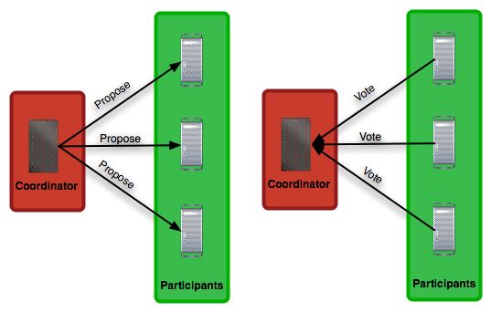

## Introduction
Most distributed systems relies on consensus: group membership systems, fault-tolerant replicated state machines, data stores. The reason "why" because consensus identical to another important problem - atomic broadcast - delivering messages in a network reliably and in total order to all nodes.

In formal terms, a consensus protocal correct if and only if:
1. Agreement - all nodes in N decide on the same value
2. Validity - the value that is decided upon must have been proposed by some node in N
3. Termination - eventually all nodes decide

###  Two-phase commit
Two-phase commit is identified by the process of two steps:
1. Contact every participant, suggest a value and gather their responses
2. If everyone aggrees upon the value, contact every participant again to let them know. Otherwise, contact every participant to abort the consensus.

The process (node) that proposes values is called coordinator. Any node can act as coordinator.

## Paxos (single decree)

In basic Paxos the system must agree on only one value to be chosen.

Main Goal: Replicated Log

Main features of Paxos are:
* consensus module that ensures proper log replication
* system makes progress as long as any majority of servers are up
* failure model: fail-stop, delayed-lost messages
* Replicated state machine implied by replicated log

Requirements:
* Safety:
..* only a single value may be chosen
..* a server never learns that a value has been chosen unless it is.
* Liveness:
..* some proposed value is eventually chosen
..* if a value is chosen, servers eventually learn about it

Paxos Components:

Proposers - active components that:
* put forth particular value to be chosen
* handle client requests

Acceptors:
* passive: respond to messages from proposers
* responses repr. votes that form consensus
* store chosen value, state of decision process
* want to know which value to be chosen

Problems and Solutions

* What if we have only one acceptor ?
  Answer: quorum based on multiple acceptors (3, 5, ...). Based on quorum the value v is chosen if accepted by majority of acceptors. If one acceptor crashes after the value has been chosen, quorum has this value

* What if the votes are split (e.g. value x and y has quorum) ?
  Answer: 2-phase protocol (once the value has been chosen, future proposals must propose/choose that same value)

* What if conflicting choices occured ?
  Answer: Order proposals, reject old ones. Each server should stores maxRound: the largest Round Number it has seen so far. It should persist on disk.

Two-phase approach:
* Phase 1: broadcast Prepare RPC
  * Find out about any chosen values (split votes resolution)
  * Block older proposals that have not yet been completed (conflict resolution)
* Phase 2: broadcast Accept RPCs
  * Ask acceptors to accept a specific value

Full Protocol

1) Proposer receives value x from client. It chooses new proposal number n
2) Proposer broadcast Prepare(n) to all of the acceptors in the cluster
3) Acceptor(s) receives the proposal number n. Acceptor does two things:
  3.1 It keeps track on minProposal value that contains the highest value it has seen so far. So if n > minPropal, then update: minProposal = n
  3.2 If it accepted so far any proposals, then it returns in response them as Return(acceptedProposal, acceptedValue)
4) Proposer receives the majority of responses:
   4.1 If any acceptedValue returned, then replace value x with acceptedValue for highest acceptedProposal
5) Proposer broadcasts Accept(n, value) to all acceptors
6) Acceptor(s) respond to Accept(n, value):
  6.1 If n >= minProposal then
         acceptedProposal=minProposal=n
         acceptedValue=value
  6.2 else: Return(minProposal) ()
7) Proposer receives majority of accept responses:
  7.1 if any rejections (result > n) ? goto (1)
  7.2 value is considered choosen and stored in log

Notes: Proposer can use information in result to build new proposal number
       Acceptors must record minProposal, acceptedProposal and acceptedValue on disk.

Problems in single-decree Paxos
* Livelock between competing proposers

s1 Prepare (3.1)
s2 Prepare (3.1)
s3 Prepare (3.1)
  s3 Prepare (3.5)
  s4 Prepare (3.5)
  s5 Prepare (3.5)
     s1. Reject Accept (3.1)
     s2. Reject Accept (3.1)
     s3. Reject Accept (3.1)
        s1. Prepare (4.1)
        s2. Prepare (4.1)
        s3. Prepare (4.1)
           s3. Reject Accept (3.5)
           s4. Reject Accept (3.5)
           s5. Reject Accept (3.5)
              ...
                ...
Solution: randomized delay before restarting or leader election

* only proposers knows which value has been chosen
* if other servers want to know, must execute Paxos with their own proposals

## Multi-Paxos

Transition

* Which log entry to use for a given client request ?
Acceptor finds in its log the first place that its known not to be chosen and it tries to arrange new value to be chosen for that entry. Execute Paxos, if it's not been chosen do it again with next place that its known not to be chosen. (nextUnchosenSlot or nextUnchosenIndex).

With this approach server can handler multiple requests concurrently by selecting different log entries for each. But those commands must be executed in order on state machines.
* Leader
Strong leader in a system resolves the livelock conflict mentioned before. At any given time, only one server acts as Proposer. Another point, with only single proposer we can eliminate a prepare RPCs by preparing only once for the entire log, and then execute all proposals in accept log.

Leader elections can be done as follows:
  * let the server with highest ID acts as a leader
  * each server sends a heartbeat msg to every other server every T ms (msg contain id of the server)
  * if a server hasn't received heartbeat from server with higher ID in last 2T ms, it acts as a leader.
* Ensuring full replication of log
  1) keep retrying Accept RPCs until all acceptors respond (in background)
  2) keep track of entries that are known to be chosen
     acceptedProposal[i] = Infinity (the largest value that could be exist) (never get overwritten); maintain firstUnchosenIndex value
  4) proposer piggybacks firstUnchosenIndex in Accept RPCs. Acceptor marks all entries i chosen if: i < request.firstUnchosenIndex and acceptedProposal[i] == request.proposal (acceptor knows about most chosen entries)
  Accept(proposal=3.4, index=8, value=v, firstUnchosenIndex=7)
  5) entries from old leaders that are not considered chosen. Acceptor returns its fristUnchosenIndex in Accept replies. If proposer's firstUnchosenIndex > firstUnchosenIndex from response, then proposer sends Success RPC in background. Success(index, v): notifies acceptor of chosen entry.
  Acceptor updates information as follows:
    acceptedValue[index] = v
    acceptedProposal[index] = INFINITY
    return firstUnchosenIndex => this allows to proposer send another Success RPC
* Client protocol
Send commands to leader
..* if leader unknown, contact any server
..* if contacted server is not a leader, it will redirect to leader
Leader does not respond until command has been chosen for log entry and executed by leader's state machine.
If request times out (e.g. leader crash)
* client reissues command to some other server
* eventually redirected to new leader
* eventually the request will succeed
But what if leader crash after executing command but before responding ?
* client embeds unique id in each command, then server includes id in log entry. State machine records most recent command executed for each client. Before executing command, state machine checks to see if command already executed. If so: ignore new command, return response from old command.
  Result: exactly-once semantics as long as client doesn't crash.
* Configuration changes
Reasons: replace failed machines, change degree of replication

Safety requirement:
  During configuration changes, it must not be possible for different majorities to choose different values for the same log entry:
   ----
   ssssssssss
   ----------
  Solution by Leslie Lamport: use log to manage configuration changes:
    * configuration is stored as log entry
    * replicated like any other log entry
    * configuration for choosing entry i determined by entry i - alpha. Suppose a = 3:
    1 2 3 4 5 6 7 8 9 10 11
    c1  c2
    -----
     c0
         ----
         c1
              ---------------
                    c2
Notes: alpha limits concurrency: can't choose entry i+alpha until entry i chosen.

## Multi-Paxos

### 3.1 Persistent state per acceptor

Acceptor keeps track:
* lastLogIndex: the biggest entry for which this server has accepted a proposal
* minProposal: the number of the smallest proposal this server will accept for any log entry, or 0 if it has never received a Prepare request. This applies globally to all entries.
* acceptedProposal[i]: the number of the last proposal the server has accepted for this etnry, or 0 if it never accepted any, or infinity if acceptedValue[i] is known to be chosen
* acceptedValue[i]: the value in the last proposal the server accepted for this entry, or null if it never accepted any

Define firstUnchosenIndex as the smallest log index i > 0 for which acceptedProposal[i] < infinity

### 3.2 Persistent state per proposer
* maxRound: the largest round number the proposer has seen

### 3.3 Soft state per proposer
* nextIndex: the index of the next entry to use for a client request
* prepared: True means there is no need to issue Prepare requests (a majority of acceptors has responded to Prepare requests with noMoreAccepted true); initially false

### 3.4 Messages

#### 3.4.1 Prepare phase

Request fields:
* n: a new proposal number
* index: the log entry that a proposer is requesting information about
Upon receiving a Prepare request, if request.n >= minProposal, the acceptor sets minProposal to request.n. The response  constitutes a promise to reject Accept requests (for any log entry) with proposals numbered less than request.n
Response fields:
* acceptedProposal: the acceptor's acceptedProposal[index]
* acceptedValue: the acceptor's acceptedValue[index]
* noMoreAccepted: set to true if this acceptor has never accepted a value for a log entry with index greater than index

#### 3.4.2 Accept phase

Request fields:
* n: the same proposal number used in the most recent Prepare
* index: identifies a log entry
* v: a value, either the highest numbered one from a Prepare response, or if none, then one from a client request.
* firstUnchosenIndex: the sender's firstUnchosenIndex
Upon receiving an Accept request: if n >= minProposal, then:
* Set acceptedProposal[index] = n
* Set acceptedValue[index] = v
* Set minProposal = n
For every index < request.firstUnchosenIndex, if acceptedProposal[index] = n, set acceptedProposal[index] to infinity.
Response fields:
* n: the acceptor's minProposal
* firstUnchosenIndex: the acceptor's firstUnchosenIndex

#### 3.4.3 Success phase

Request fields:
* index: identifies a log entry
* v: the chosen value for entry index
Upon receiving a Success request, set acceptedValue[index] to v and acceptedProposal[index] = infinity
Response fields:
* firstUnchosenIndex: the acceptor's first Unchosen Index.
When sender receives the response if reply.firstUnchosenIndex < firstUnchosenIndex then sends Success(index=reply.firstUnchosenIndex, value=acceptedValue[reply.firstUnchosenIndex]).

### 3.5 Proposer Protocol: write(inputValue) -> bool

1. If not leader or not done with leader initialization, return false
2. If prepared is true:
..(a) Let index=nextIndex, increment nextIndex
..(b) Go to step 6
3. Let index=firstUnchosenIndex and nextIndex=index + 1
4. Let n be a new proposal number (increment and persist maxRound)
5. Broadcast Prepare(n, index) request to all acceptors
6. Upon receiving Prepare responses (reply.acceptedProposal, reply.acceptedValue, reply.noMoreAccepted) from a majority of acceptors:
..* Let v be set as follows: if the maximum reply.acceptedProposal in the replies isn't 0, use its corresponding reply.acceptedValue. Otherwise, use inputValue.
..* if all acceptors in the majority responded with reply.noMoreAccepted, set prepared=true
7. Broadcast Accept(index, n, v) request to all acceptors
8. Upon receiving an Accept response with (reply.n, reply.firstUnchosenIndex):
..* If reply.n > n, set maxRound from reply.n. Set prepared = false. Go to step 1.
..* if reply.firstUnchosenIndex <= lastLogIndex and acceptedProposal[reply.firstUnchosenIndex]=infinity then send Success(index=reply.firstUnchosenIndex, value=acceptedValue[reply.firstUnchosenIndex]).
9. Upon receiving Accept responses for n from a majority of acceptors:
..* Set acceptedProposal[i]=infinity and acceptedValue[index]=v
10. If v == inputValue, return true.
11. Go to step 2

## Reconfiguration

* Configuration is a list of ids and addresses of servers, stored as special log entries
* Configuration for choosing entry i determined by latest configuration in log entry i - alpha or below.
* alpha limits concurrency: can't choose entry i + alpha until entry i is chosen.
